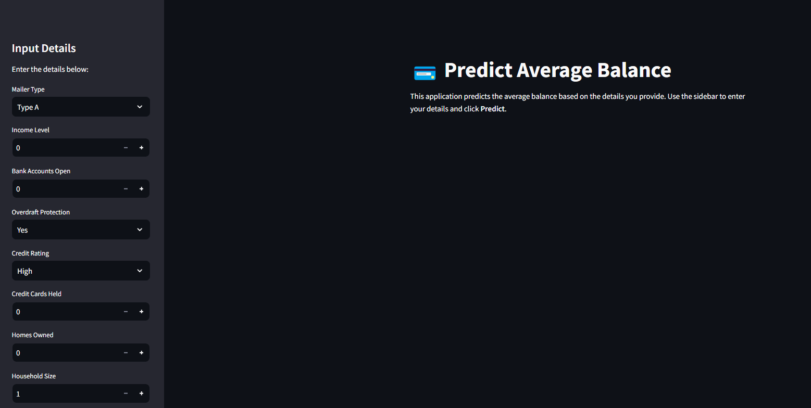

# Marketing Prediction Application



## Overview

This project is a **Marketing Prediction Application** that uses machine learning models to predict the average balance of customers based on provided inputs. The application comprises a Flask API for backend computations and a Streamlit interface for user interaction.

---

## Directory Structure

```plaintext
tahahamdii-marketing-prediction/
├── app.py               # Flask backend for prediction API
├── stream.py            # Streamlit frontend for user interaction
└── models/              # Pretrained models and encoders
    ├── Credit Rating_encoder.joblib
    ├── Income Level_encoder.joblib
    ├── Offer_Accepted_encoder.joblib
    ├── Overdraft Protection_encoder.joblib
    ├── Own Your Home_encoder.joblib
    ├── Reward_encoder.joblib
    ├── adaboost_model_optimized.joblib
    ├── kmeans_model.joblib
    ├── scaler_average_balance.joblib
    └── xgboost_model_optimized.joblib
